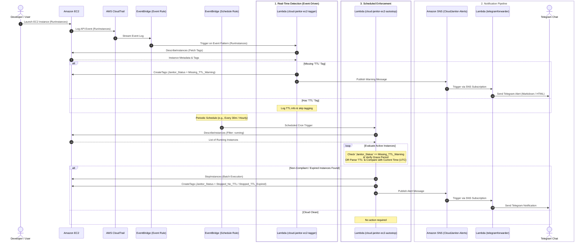

```mermaid
sequenceDiagram
    autonumber
    actor Dev as Developer / User
    participant EC2 as Amazon EC2
    participant CT as AWS CloudTrail
    participant EB_Event as EventBridge (Event Rule)
    participant EB_Cron as EventBridge (Schedule Rule)
    participant Tagger as Lambda (cloud-janitor-ec2-tagger)
    participant AutoStop as Lambda (cloud-janitor-ec2-autostop)
    participant SNS as Amazon SNS (CloudJanitor-Alerts)
    participant Forwarder as Lambda (telegramforwarder)
    actor TG as Telegram Chat

    box 1. Real-Time Detection (Event-Driven)
        participant Dev
        participant EC2
        participant CT
        participant EB_Event
        participant Tagger
    end

    box 2. Notification Pipeline
        participant SNS
        participant Forwarder
        participant TG
    end

    box 3. Scheduled Enforcement
        participant EB_Cron
        participant AutoStop
    end

    %% Flow 1: Real-time Event Detection on Instance Launch
    Dev->>EC2: Launch EC2 Instance (RunInstances)
    EC2->>CT: Log API Event (RunInstances)
    CT->>EB_Event: Stream Event Log
    EB_Event->>Tagger: Trigger on Event Pattern (RunInstances)
    
    Tagger->>EC2: DescribeInstances (Fetch Tags)
    EC2-->>Tagger: Instance Metadata & Tags
    
    alt Missing 'TTL' Tag
        Tagger->>EC2: CreateTags (Janitor_Status = Missing_TTL_Warning)
        Tagger->>SNS: Publish Warning Message
        SNS->>Forwarder: Trigger via SNS Subscription
        Forwarder->>TG: Send Telegram Alert (Markdown / HTML)
    else Has 'TTL' Tag
        Note over Tagger: Log TTL info & skip tagging
    end

    %% Flow 2: Scheduled Enforcement & Stop
    Note over EB_Cron: Periodic Schedule (e.g., Every 30m / Hourly)
    EB_Cron->>AutoStop: Scheduled Cron Trigger
    AutoStop->>EC2: DescribeInstances (Filter: running)
    EC2-->>AutoStop: List of Running Instances

    loop Evaluate Active Instances
        Note over AutoStop: Check 'Janitor_Status' == Missing_TTL_Warning<br/>& Verify Grace Period<br/>OR Parse 'TTL' & Compare with Current Time (UTC)
    end

    alt Non-Compliant / Expired Instances Found
        AutoStop->>EC2: StopInstances (Batch Execution)
        AutoStop->>EC2: CreateTags (Janitor_Status = Stopped_No_TTL / Stopped_TTL_Expired)
        AutoStop->>SNS: Publish Alert Message
        SNS->>Forwarder: Trigger via SNS Subscription
        Forwarder->>TG: Send Telegram Notification
    else Cloud Clean
        Note over AutoStop: No action required
    end
```
